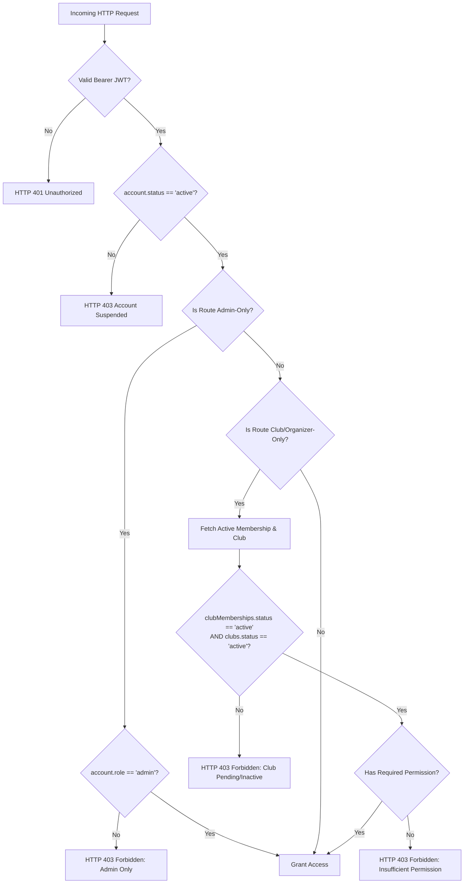
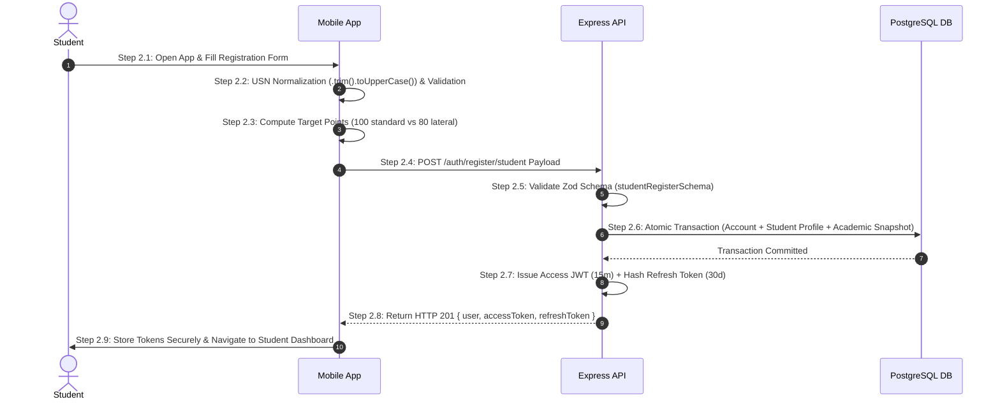
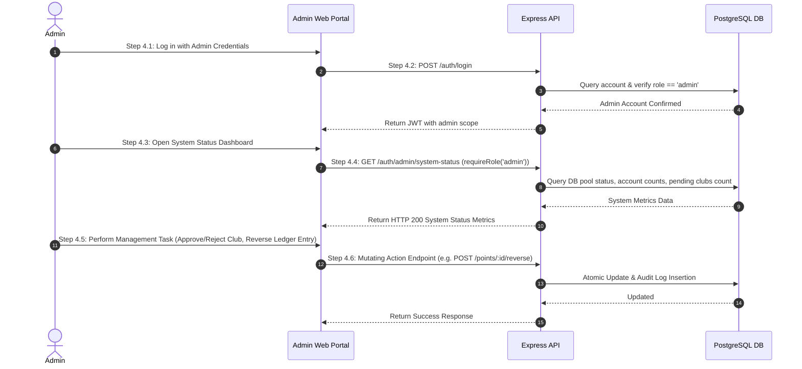
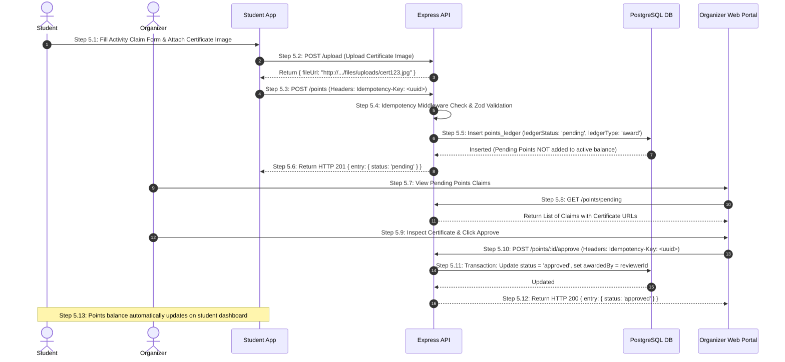
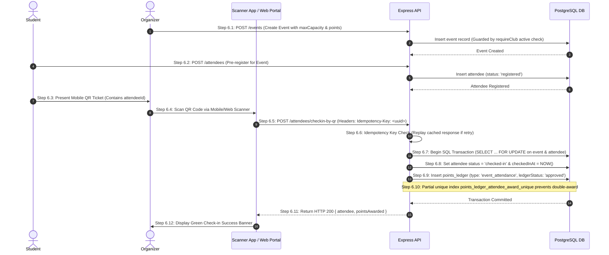
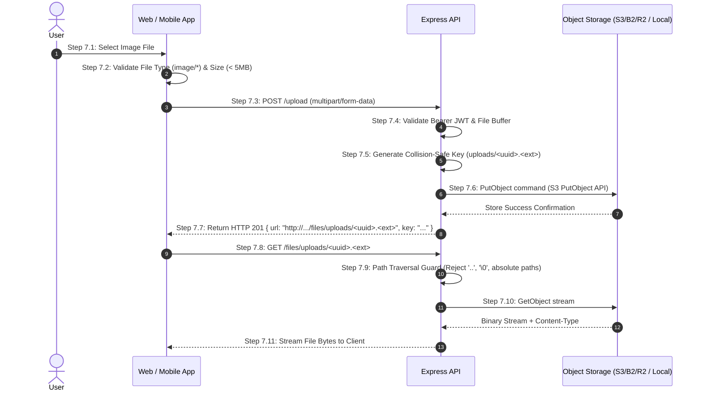

# 🚀 PointsTrack Onboarding & Registration Guide

This document details the complete step-by-step onboarding, verification, operational, and administrative workflows for **Students**, **Clubs (Organizers)**, **Administrators**, **Self-Tracked Submissions**, **Walk-up Event Check-ins**, and **Image Storage** within the PointsTrack ecosystem.

---

## 🏛️ 1. Identity & Authorization Architecture Context

PointsTrack operates on a **canonical V2 identity and authorization model**:
* **Identity Accounts**: Every user account exists in the `accounts` table with an account role (`'student'`, `'organizer'`, or `'admin'`).
* **Non-Authoritative Account Role**: `accounts.role = 'organizer'` is an account type classification marker. **It does not grant access to club management endpoints by itself.**
* **Canonical Authorization Source**: Organizer and administrative capabilities are derived strictly from active club memberships (`clubMemberships.status = 'active'`) and active club status (`clubs.status = 'active'`).
* **Club Approval Lifecycle**: Newly registered clubs start in `status: 'pending'` and require explicit administrative activation (`PATCH /clubs/:id/status` by an `admin`) before event creation or point distribution is permitted.

```
                      ┌────────────────────────────────────────┐
                      │            accounts (table)            │
                      │  - id (UUID)                           │
                      │  - email (lowercase)                   │
                      │  - password_hash                       │
                      │  - role ('student'|'organizer'|'admin')│
                      │  - status ('active'|'suspended')       │
                      └───────────────────┬────────────────────┘
                                          │
            ┌─────────────────────────────┼─────────────────────────────┐
            ▼                             ▼                             ▼
┌──────────────────────┐      ┌──────────────────────┐      ┌──────────────────────┐
│   students (table)   │      │    clubs (table)     │      │   club_memberships   │
│  - Name, College     │      │  - name, slug        │      │  - accountId, clubId │
│  - USN (Normalized)  │      │  - createdBy         │      │  - role ('owner'|...)│
│  - Year, Semester    │      │  - status ('pending' │      │  - status ('active'  │
│  - Required Points   │      │    | 'active'|...)   │      │    | 'pending'|...)  │
└──────────────────────┘      └──────────────────────┘      └──────────────────────┘
```

### 🔄 Authorization Step-by-Step Resolution Engine

Whenever a request hits an authenticated endpoint, the authorization middleware evaluates access according to the following step-by-step sequence:



---

## 📱 2. Student Onboarding & Registration Flow (Mobile Client)

Students onboard through the **PointsTrack React Native (Expo) Mobile App**.

### 🟢 Sequence Diagram: Student Registration



### 📋 Detailed Action Steps for Student Onboarding

1. **Step 2.1: Information Entry**
   - The student opens the mobile application and selects **"Register as Student"**.
   - Input fields:
     - **Full Name**: e.g., `John Doe`
     - **Email Address**: e.g., `student@rvce.edu.in` (validated against standard email regex).
     - **Password**: Minimum 6 characters.
     - **University Seat Number (USN)**: e.g., `1rv23cs042`.
     - **College Affiliation**: Selected from dropdown (e.g., `R.V. College of Engineering`).
     - **Current Academic Year & Semester**: e.g., Year `2`, Semester `3`.
     - **Lateral Entry Toggle**: Switch indicating whether the student joined via diploma lateral entry.

2. **Step 2.2: USN Format Normalization & Validation**
   - The client application executes sanitization:
     ```typescript
     const normalizedUSN = inputUSN.trim().toUpperCase();
     ```
   - Validates that USN matches the expected pattern for the selected college code (e.g., matching `^1[A-Z]{2}\d{2}[A-Z]{2}\d{3}$`).

3. **Step 2.3: Point Target Calculation**
   - **Standard Entry (Toggle OFF)**: Configures `requiredPoints = 100`.
   - **Lateral Entry (Toggle ON)**: Configures `requiredPoints = 80` (accounting for exemption of 1st-year points).

4. **Step 2.4: Registration API Request**
   - App dispatches `POST /auth/register/student` with payload:
     ```json
     {
       "email": "student@rvce.edu.in",
       "password": "SecurePassword123",
       "name": "John Doe",
       "college": "R.V. College of Engineering",
       "usn": "1RV23CS042",
       "year": 2,
       "semester": 3,
       "lateralEntry": false
     }
     ```

5. **Step 2.5: API Schema Validation**
   - API middleware parses request body against `studentRegisterSchema`. Rejects invalid inputs with `HTTP 400 Bad Request`.

6. **Step 2.6: Atomic Database Transaction**
   - Executes inside a single database transaction (`db.transaction`):
     - Inserts record into `accounts` (`role: 'student'`, `status: 'active'`).
     - Inserts record into `students` referencing `account.id`, storing normalized USN and calculated `requiredPoints`.
     - Inserts initial snapshot in `student_academic_records` (`requiredPointsSnapshot: 100`).

7. **Step 2.7: Session & Token Generation**
   - API signs a short-lived JWT access token (15 minutes).
   - Generates a cryptographically random refresh token (30 days), hashes it with SHA-256, and stores it in `refresh_tokens`.

8. **Step 2.8: Mobile Response Handling**
   - API responds with `HTTP 201 Created` containing user object and session tokens.

9. **Step 2.9: Navigation & Secure Storage**
   - Mobile app saves access token in memory/SecureStore, stores refresh token in encrypted local storage, and redirects the student to their personal dashboard.

---

## 💻 3. Club / Organizer Onboarding & Activation Flow (Web Dashboard)

Clubs onboard via the **pointstrack-admin Next.js Web Portal**.

### 🟢 Sequence Diagram: Club Onboarding & Approval

```mermaid
sequenceDiagram
    autonumber
    actor Organizer
    actor Admin
    participant Web as Web Dashboard
    participant API as Express API
    participant DB as PostgreSQL DB

    Organizer->>Web: Step 3.1: Submit Registration Form (Club & Account Details)
    Web->>API: Step 3.2: POST /auth/register/organizer Payload
    API->>API: Step 3.3: Validate Zod Schema (organizerRegisterSchema)
    API->>DB: Step 3.4: Atomic Transaction (Account + Organizers Row + Club 'pending' + Owner Membership)
    DB-->>API: Transaction Committed
    API-->>Web: Step 3.5: Return HTTP 201 { club: { status: 'pending' }, tokens }
    Note over Organizer,Web: Step 3.6: Organizer is gated in pending state (cannot create events)

    Admin->>Web: Step 3.7: Open Admin Portal & Inspect Pending Clubs
    Web->>API: Step 3.8: GET /clubs?status=pending (Guarded by requireRole('admin'))
    API-->>Web: Return List of Pending Clubs
    Admin->>Web: Step 3.9: Click "Approve Club"
    Web->>API: Step 3.10: PATCH /clubs/:id/status { status: 'active' }
    API->>DB: Step 3.11: Update club status to 'active'
    DB-->>API: Updated
    API-->>Web: Step 3.12: Return HTTP 200 { club: { status: 'active' } }
    Note over Organizer,Web: Step 3.13: Club is activated; Organizer can now publish events
```

### 📋 Detailed Action Steps for Organizer Onboarding

1. **Step 3.1: Web Registration Form Submission**
   - The prospective organizer navigates to `http://localhost:3000/auth/register`.
   - Input fields:
     - **Organizer Full Name**: e.g., `Alice Smith`.
     - **Email Address**: e.g., `codingclub@rvce.edu.in`.
     - **Password**: Minimum 6 characters.
     - **Club Name**: e.g., `Coding Club RVCE`.
     - **College**: e.g., `R.V. College of Engineering`.
     - **Club Category / Description**: e.g., `Technical & Competitive Programming`.

2. **Step 3.2: API Registration Request**
   - Web portal sends `POST /auth/register/organizer` with payload:
     ```json
     {
       "email": "codingclub@rvce.edu.in",
       "password": "ClubPassword123",
       "name": "Alice Smith",
       "clubName": "Coding Club RVCE",
       "college": "R.V. College of Engineering",
       "description": "Technical & Competitive Programming"
     }
     ```

3. **Step 3.3: Server Schema Validation**
   - Request is parsed against `organizerRegisterSchema`. Ensures uniqueness of email and club slug (`coding-club-rvce`).

4. **Step 3.4: Transactional Provisioning**
   - API starts an atomic SQL transaction:
     - Creates `accounts` record (`role: 'organizer'`, `status: 'active'`).
     - Creates compatibility row in `organizers`.
     - Creates `clubs` record with **`status: 'pending'`** and generated slug.
     - Creates `club_memberships` entry (`role: 'owner'`, `status: 'active'`).
     - Initializes `club_branding` with default accent color (`#06B6D4`).

5. **Step 3.5: Pending State Session Response**
   - API returns `HTTP 201 Created` with tokens and club profile (`status: 'pending'`).

6. **Step 3.6: Activation Gate Enforcement**
   - When the organizer logs in, the web portal detects `club.status === 'pending'`.
   - The user interface displays a **"Pending Administrator Approval"** banner.
   - Any API requests to create events (`POST /events`) or manage attendees are rejected with `HTTP 403 Forbidden` (`"You need an active club profile or active club membership to do this."`).

7. **Step 3.7: Admin Portal Inspection**
   - An administrator logs into `pointstrack-admin` with an account having `accounts.role = 'admin'`.

8. **Step 3.8: Fetch Pending Approvals**
   - Web portal requests `GET /clubs?status=pending` (guarded by `requireRole('admin')`).

9. **Step 3.9: Verification of Club Authenticity**
   - Admin verifies club details, faculty advisor contact, and college affiliation.

10. **Step 3.10: Approval Dispatch**
    - Admin clicks **"Approve & Activate Club"**, sending `PATCH /clubs/:id/status` with `{ "status": "active" }`.

11. **Step 3.11: Database Status Mutation**
    - API executes SQL update setting `clubs.status = 'active'`.

12. **Step 3.12: Response & WebSocket / Refetch Update**
    - API responds with `HTTP 200 OK`.

13. **Step 3.13: Workspace Unlocked**
    - On next page refresh or refetch, the organizer's workspace unlocks event creation, QR scanner tools, and attendance management.

---

## 🛠️ 4. Administrator Onboarding & System Setup Flow

Administrators manage system health, approve pending clubs, adjust student credit thresholds, and audit points ledgers.

### 🟢 Sequence Diagram: System Admin Operations



### 📋 Detailed Action Steps for Admin Operations

1. **Step 4.1: Admin Authentication**
   - Administrator navigates to the login screen and submits admin email and password.

2. **Step 4.2: Role Verification during Login**
   - API verifies password hash and confirms `account.role === 'admin'`.

3. **Step 4.3: Navigation to Admin Overview**
   - Admin accesses the `/admin` portal tab.

4. **Step 4.4: System Status Diagnostic (`GET /auth/admin/system-status`)**
   - Web app polls system status endpoint. The route is protected by `requireAuth` and `requireRole('admin')`.
   - Returns counts of active students, active clubs, pending clubs, total points awarded, and storage health.

5. **Step 4.5: Pending Club Review & Action**
   - Admin reviews submitted clubs. Can execute approval (`status: 'active'`) or rejection (`status: 'rejected'`).

6. **Step 4.6: Points Ledger Override & Reversals (`POST /points/:id/reverse`)**
   - In case of fraudulent or duplicate submissions, admin can invoke ledger reversal.
   - API creates a reversing entry in `points_ledger` with `reversesLedgerId` pointing to original entry, atomically decrementing the student's balance.

---

## 🏅 5. Self-Tracked Points Submission & Approval Flow

Students can submit off-campus certificates or extra-curricular activities for point credits.

### 🟢 Sequence Diagram: Self-Tracked Points Lifecycle



### 📋 Detailed Action Steps for Self-Tracked Points

1. **Step 5.1: Certificate Evidence Preparation**
   - Student selects **"Submit Activity Claim"** in the mobile app.
   - Inputs title (e.g. `Hackathon Winner - Smart India Hackathon`), description, date, semester (1–8), requested points (1–100), and uploads certificate image.

2. **Step 5.2: Image Upload (`POST /upload`)**
   - App dispatches image payload to `/upload`. Server validates MIME type and file size (max 5MB) and returns public proxy URL.

3. **Step 5.3: Idempotent Points Submission Request (`POST /points`)**
   - App generates a unique `Idempotency-Key` (UUIDv4) and sends request body:
     ```json
     {
       "title": "Hackathon Winner - Smart India Hackathon",
       "type": "Hackathon",
       "description": "1st place in National Smart India Hackathon 2026",
       "points": 25,
       "date": "2026-09-10",
       "certificateUrl": "http://localhost:4000/files/uploads/cert123.jpg",
       "semester": 3
     }
     ```

4. **Step 5.4: Middleware Validation**
   - `requireIdempotency()` middleware intercepts request. Calculates SHA-256 hash of `(method, path, body)`.
   - `entrySchema` checks `points` is between 1 and 100, and `semester` is between 1 and 8.

5. **Step 5.5: Pending Ledger Entry Insertion**
   - Inserts row in `points_ledger` with `ledgerStatus: 'pending'` and `type: 'activity'`.
   - **Crucial Invariant**: Pending entries do **NOT** contribute to `totalEarnedPoints` or completion percentage calculations.

6. **Step 5.6: Student Feedback**
   - API returns `HTTP 201 Created`. Mobile app displays **"Submitted - Pending Review"** status badge.

7. **Step 5.7: Organizer Queue Review**
   - Organizer or Admin opens the web dashboard tab **"Pending Claims"**.

8. **Step 5.8: Claim Retrieval (`GET /points/pending`)**
   - Portal lists pending submissions for the student's department/college.

9. **Step 5.9: Certificate Verification**
   - Organizer clicks certificate link, verifying authenticity and match with claim title.

10. **Step 5.10: Approval Request (`POST /points/:id/approve`)**
    - Organizer clicks **"Approve Claim"**. Client includes `Idempotency-Key`.

11. **Step 5.11: Atomic Balance Update**
    - API executes SQL update:
      - Sets `ledgerStatus = 'approved'`.
      - Sets `awardedBy = reviewerAccountId`.
      - Sets `awardedAt = NOW()`.
    - Points are now instantly reflected in the student's active balance.

12. **Step 5.12: Response Confirmation**
    - API returns `HTTP 200 OK`.

13. **Step 5.13: Mobile Balance Refetch**
    - Mobile app updates student's total points balance and visual progress ring.

---

## 🎟️ 6. Walk-up Event Registration, Check-in & Award Flow

Clubs create events, students pre-register or present QR codes, and organizers perform instant check-ins with single-scan point awards.

### 🟢 Sequence Diagram: Event Check-in & QR Award Lifecycle



### 📋 Detailed Action Steps for Walk-up Event & Check-in

1. **Step 6.1: Event Publishing (`POST /events`)**
   - Organizer creates an event specifying `title`, `date`, `location`, `maxCapacity`, and `pointsValue` (e.g. 15 points).
   - Middleware confirms organizer has `clubMemberships.status = 'active'` AND `clubs.status = 'active'`.

2. **Step 6.2: Student Registration (`POST /attendees`)**
   - Student clicks **"Register for Event"** in mobile app. API creates record in `attendees` with `status: 'registered'`.

3. **Step 6.3: Dynamic QR Code Presentation**
   - Student opens event ticket screen. Mobile app renders a dynamic QR code containing signed payload with `attendeeId`, `eventId`, and `studentId`.

4. **Step 6.4: Organizer Scanner Activation**
   - Organizer opens scanner screen in `pointstrack-admin` web app or organizer mobile view. Camera activates.

5. **Step 6.5: QR Scan Dispatch (`POST /attendees/checkin-by-qr`)**
   - Scanner captures QR payload and sends check-in request with header `Idempotency-Key: <uuid>`:
     ```json
     {
       "attendeeId": "c8f3b2a1-7d4e-4f9a-8b1c-2d3e4f5a6b7c",
       "eventId": "e1d2c3b4-a5f6-7e8d-9c0b-1a2b3c4d5e6f"
     }
     ```

6. **Step 6.6: Idempotency Check**
   - If network glitch causes scanner app to re-send identical scan within 24 hours, idempotency middleware intercepts key and returns cached `HTTP 200 OK` without re-processing.

7. **Step 6.7: Transactional Locking (`FOR UPDATE`)**
   - API opens SQL transaction and executes row-level lock on `attendees` and `events_catalog` rows to prevent concurrent scan race conditions.

8. **Step 6.8: Attendee Status Mutation**
   - Updates `attendees.status` to `'checked-in'` and sets `checkedInAt = NOW()`.

9. **Step 6.9: Points Ledger Award Insertion**
   - Inserts row in `points_ledger`:
     - `studentId`: student account ID
     - `points`: event's configured `pointsValue`
     - `type`: `'event_attendance'`
     - `ledgerStatus`: `'approved'`
     - `attendeeId`: reference to attendee record.

10. **Step 6.10: Database-Level Single-Award Constraint**
    - PostgreSQL enforces partial unique index:
      ```sql
      CREATE UNIQUE INDEX "points_ledger_attendee_award_unique"
      ON "points_ledger" ("attendee_id")
      WHERE type = 'event_attendance' AND reverses_ledger_id IS NULL;
      ```
    - Even if 10 concurrent requests bypass middleware, PostgreSQL rejects duplicate awards with constraint violation (`23505`), guaranteeing exact-once point credit.

11. **Step 6.11: API Response Payload**
    - API returns `HTTP 200 OK` with checked-in attendee profile and points awarded.

12. **Step 6.12: UI Confirmation**
    - Scanner plays success chime and renders green confirmation banner with student's name and USN.

---

## 🖼️ 7. Image Upload & Storage Management Flow

PointsTrack supports image uploads for club logos, banners, event flyers, and activity certificates.

### 🟢 Sequence Diagram: Storage Lifecycle



### 📋 Detailed Action Steps for Image Storage

1. **Step 7.1: Image Selection**
   - User selects an image file from device gallery or file picker.

2. **Step 7.2: Pre-flight Client Validation**
   - Client checks file size (must be $\le$ 5MB) and MIME type (`image/png`, `image/jpeg`, `image/webp`).

3. **Step 7.3: Upload Dispatch (`POST /upload`)**
   - Client sends multipart request with `file` field and Bearer token header.

4. **Step 7.4: Server Authentication & File Parsing**
   - `requireAuth` middleware verifies token. Multer middleware buffers file in memory.

5. **Step 7.5: Key Generation**
   - API generates unique key using UUIDv4 prefix:
     ```typescript
     const key = `uploads/${crypto.randomUUID()}.${ext}`;
     ```

6. **Step 7.6: Storage Backend Execution**
   - Storage service delegates to configured provider:
     - **Object Storage (Cloudflare R2 / Backblaze B2)**: Sends `PutObjectCommand` via `@aws-sdk/client-s3`.
     - **Local Disk Fallback**: Writes buffer to `./uploads/<filename>`.

7. **Step 7.7: Public URL Generation**
   - Returns proxy URL format: `http://localhost:4000/files/uploads/<uuid>.<ext>`.

8. **Step 7.8: Asset Retrieval (`GET /files/*`)**
   - Client requests asset URL for display in UI.

9. **Step 7.9: Security Sanitization Guard**
   - Proxy handler validates requested file path:
     - Rejects relative path traversal attempts (`..`).
     - Rejects null byte injection (`\0`).
     - Rejects absolute paths (`/etc/passwd`).

10. **Step 7.10: Object Streaming**
    - API streams file content with matching `Content-Type` header (e.g. `image/png`).

11. **Step 7.11: Asset Delivery**
    - Browser/Mobile app renders image seamlessly.

---

## ⚡ 8. Express Route & Middleware Reference Table

| Route | Method | Authorization Middleware | Idempotency | Primary Function |
| :--- | :--- | :--- | :--- | :--- |
| `/auth/register/student` | `POST` | Public | No | Register new student profile (100 or 80 required pts) |
| `/auth/register/organizer` | `POST` | Public | No | Register organizer & create pending club |
| `/auth/login` | `POST` | Public | No | Authenticate user & return JWT tokens |
| `/auth/refresh` | `POST` | Public | No | Rotate refresh token & issue new access JWT |
| `/auth/me` | `GET` | `requireAuth` | No | Fetch authenticated user, active clubs & memberships |
| `/auth/admin/system-status` | `GET` | `requireAuth`, `requireRole('admin')` | No | System health & administration panel |
| `/clubs` | `POST` | `requireAuth` | No | Create new club (starts in `pending` status) |
| `/clubs/:id` | `PATCH` | `requireAuth`, `requirePermission('club.update')` | No | Update club metadata (owner cannot self-approve status) |
| `/clubs/:id/status` | `PATCH` | `requireAuth`, `requireRole('admin')` | No | Admin activation (`pending` $\rightarrow$ `active` / `rejected`) |
| `/events` | `POST` | `requireAuth`, `requireClub` | No | Publish new event (requires active club status) |
| `/attendees` | `POST` | `requireAuth` | No | Register student for an event |
| `/attendees/checkin-by-qr` | `POST` | `requireAuth` | **Yes** | Scan student QR code, check in & award points atomically |
| `/points` | `POST` | `requireAuth`, `requireRole('student')` | **Yes** | Submit self-tracked points entry (starts as `pending`) |
| `/points/:id/approve` | `POST` | `requireAuth` | **Yes** | Organizer/Admin approves pending self-tracked entry |
| `/points/:id/reject` | `POST` | `requireAuth` | No | Organizer/Admin rejects pending self-tracked entry |
| `/points/:id/reverse` | `POST` | `requireAuth` | No | Reverse an awarded points ledger entry |
| `/profile/student/:id` | `GET` | `requireAuth` | No | Relational Privacy Guard (scoped to active club/event) |
| `/upload` | `POST` | `requireAuth` | No | Upload image to object storage |
| `/files/*` | `GET` | Key Sanitization Guard | No | Stream private bucket assets with path traversal protection |

---

## 📑 9. Technical Schema Reference

### Student Registration Schema (`studentRegisterSchema`)
```typescript
const studentRegisterSchema = z.object({
  email: z.string().email(),
  password: z.string().min(6),
  name: z.string().min(1),
  phone: z.string().optional(),
  college: z.string().min(1),
  collegeCode: z.string().optional(),
  region: z.string().optional(),
  usn: z.string().min(1),
  year: z.coerce.number().int().min(1).default(1),
  semester: z.coerce.number().int().min(1).default(1),
  lateralEntry: z.boolean().default(false),
});
```

### Organizer Registration Schema (`organizerRegisterSchema`)
```typescript
const organizerRegisterSchema = z.object({
  email: z.string().email(),
  password: z.string().min(6),
  name: z.string().min(1),
  clubName: z.string().min(1),
  college: z.string().min(1),
  description: z.string().optional(),
});
```

### Self-Tracked Points Entry Schema (`entrySchema`)
```typescript
const entrySchema = z.object({
  title: z.string().min(1),
  type: z.string().min(1).default('Activity'),
  description: z.string().optional(),
  points: z.coerce.number().int().min(1).max(100).default(10),
  date: z.string().min(1),
  certificateUrl: z.string().optional(),
  semester: z.coerce.number().int().min(1).max(8).default(1),
});
```

### Idempotency Table Schema (`idempotency_keys`)
```sql
CREATE TABLE IF NOT EXISTS "idempotency_keys" (
	"id" uuid PRIMARY KEY DEFAULT gen_random_uuid() NOT NULL,
	"account_id" uuid NOT NULL REFERENCES "accounts"("id") ON DELETE CASCADE,
	"key" text NOT NULL,
	"request_hash" text NOT NULL,
	"status" text DEFAULT 'pending' NOT NULL,
	"response_status" integer,
	"response_body" jsonb,
	"created_at" timestamp with time zone DEFAULT now() NOT NULL,
	"expires_at" timestamp with time zone NOT NULL,
	CONSTRAINT "idempotency_keys_account_key_unique" UNIQUE("account_id", "key")
);
```

---

## 🧪 10. Automated Verification & Troubleshooting Commands

To verify onboarding workflows and API compliance, run the automated verification scripts from `/home/vaibhav/projects/points/pointstrack-api`:

### 1. HTTP Authorization Boundary Verification
```bash
npx tsx scripts/verify-authorization-matrix.ts
```
*Verifies student isolation, pending club gating (403), active club access, and admin privileges.*

### 2. HTTP Idempotency Suite Verification
```bash
npx tsx scripts/verify-http-idempotency.ts
```
*Verifies exact replay behavior, header generation, cross-user key isolation, payload mismatch rejection (422), and concurrent scan safety.*

### 3. Object Storage Integration Verification
```bash
npx tsx scripts/verify-r2-integration.ts
```
*Verifies object upload, binary stream retrieval, content-type preservation, and file deletion.*

### 4. Full Release Proof Execution
```bash
npx tsx scripts/run-all-release-proofs.ts
```
*Runs all test suites sequentially to certify release readiness.*

---

## ❓ Common Error Resolution Guide

| Error Response | Root Cause | Resolution Step |
| :--- | :--- | :--- |
| `HTTP 403 Forbidden` (`"You need an active club profile..."`) | Organizer attempted to create an event while `clubs.status === 'pending'`. | Log in as system administrator and activate club via `PATCH /clubs/:id/status` with `{ "status": "active" }`. |
| `HTTP 409 Conflict` (`"USN already registered"`) | A student account with the same normalized USN already exists. | Verify USN spelling or reset password for existing account. |
| `HTTP 422 Unprocessable Entity` (`"Idempotency key payload mismatch"`) | Re-using an `Idempotency-Key` header with a different JSON body payload. | Ensure client generates a fresh UUID for distinct HTTP operations. |
| `HTTP 400 Bad Request` (`"Invalid file format"`) | File uploaded to `/upload` is not an allowed image MIME type. | Upload PNG, JPEG, or WebP image under 5MB. |
